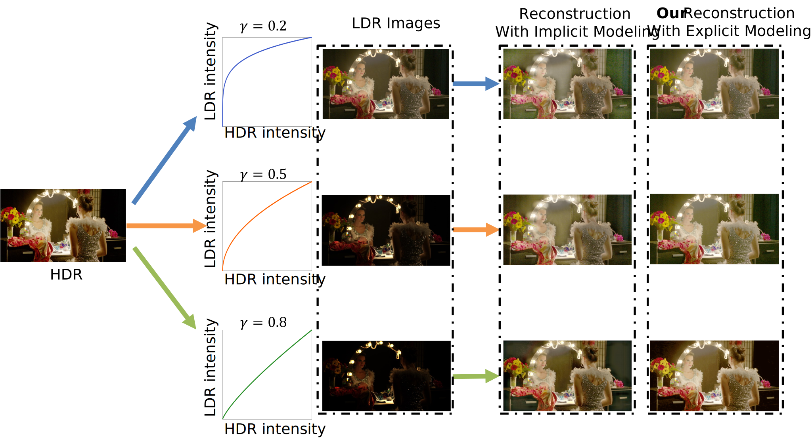
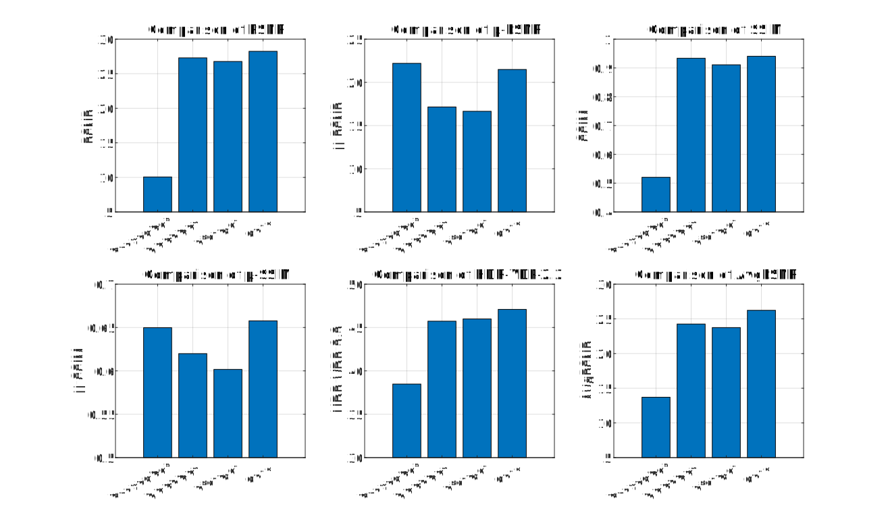

# EPCE-HDR (ECAI 2023 Oral) 
This is a pytorch project for the paper **High Dynamic Range Image Reconstruction via Deep Explicit Polynomial Curve Estimation** 

by Jiaqi Tang, Xiaogang Xu, Sixing Hu and Ying-Cong Chen* presented at **ECAI 2023**.

*: Corresponding author
<!-- **All Related Materials are Perparing.** -->

## Introduction
Due to different physical imaging parameters, the tone-mapping functions between images and real radiance are highly diverse, which makes HDR reconstruction extremely challenging. Existing solutions can not explicitly clarify a corresponding relationship between the tone-mapping function and the generated HDR image, but this relationship is vital when guiding the reconstruction of HDR images. To address this problem, we propose a method to explicitly estimate the tone mapping function and its corresponding HDR image in one network.

[Paper link](https://arxiv.org/abs/2307.16426) |
[Poster](./fig/ECAI_Poster.pdf) |
[Oral (PPT)](./fig/1024HighDynamicRange.pdf)




## Getting Started

1. [Multi TM Curves Dataset](#dataset)
2. [Environment](#environment)
3. [Configuration](#config)
4. [Usage](#usage)
5. [Evaluation](#Evaluation)

### Multi TM Curves Dataset

- You can download the original dataset from Codalab.

```
https://competitions.codalab.org/competitions/28161#participate-get-data
```

- [TODO] Or download it directly from Drive (Recommend):
[Google Drive](https://drive.google.com/file/d/1VM_WdQTnyW4pzKM88BeCi08Hc0meOkuu/view?usp=sharing).

### Environment
```
pip install -r requirements.txt
```

### Config Files

```
codes
│
└───options
│   │
│   └───test
│   │   │ test.yml (for testing in Test-Real)
│   │   │ test_sys.yml  (for testing in Test-Gamma)
│   │    
│   └───train
│       │ train.yml  (for training)
│   

```


### Usage

#### How to test

- Modify `dataroot_LQ` and `pretrain_model_G` for low range image and model, then run

```
cd codes
python test.py -opt options/test/test.yml
python test.py -opt options/test/test_sys.yml
```

The test results will be saved to `./results`.

#### How to train

- Modify `dataroot_LQ` and `dataroot_GT` in `./codes/options/train/train`, then run

```
cd codes
python train.py -opt options/train/train.yml
```

The models and training states will be saved to `./experiments`.

#### Visualization

Modify paths of the data in `./scripts/tonemapped_visualization.py` and run

```
cd scripts
python tonemapped_visualization.py
```

to visualize the images.


### Evaluation

- In addition to the recognized evaluation metrics (PSNR, SSIM etc.), we also introduce AvgPSNR as an evaluation metric. AvgPSNR is a metric that can jointly assess the PSNR values of HDR images before and after tone mapping. It is defined as,

AvgPSNR = 0.7*PSNR + 0.3 * mu-PSNR




- Testing in the wild


## Citation Information

If you find the project useful, please cite:

```
@inproceedings{Tang2023HighDR,
  title={High Dynamic Range Image Reconstruction via Deep Explicit Polynomial Curve Estimation},
  author={Jiaqi Tang and Xiaogang Xu and Sixing Hu and Ying-Cong Chen},
  booktitle={European Conference on Artificial Intelligence},
  year={2023}
}
```

## Contributions

If you have any questions, feel free to e-mail the author Jiaqi Tang ([jtang092@connect.ust.hk](jtang092@connect.ust.hk)). Besides, these codes are built on [HDRUNET](https://github.com/chxy95).
